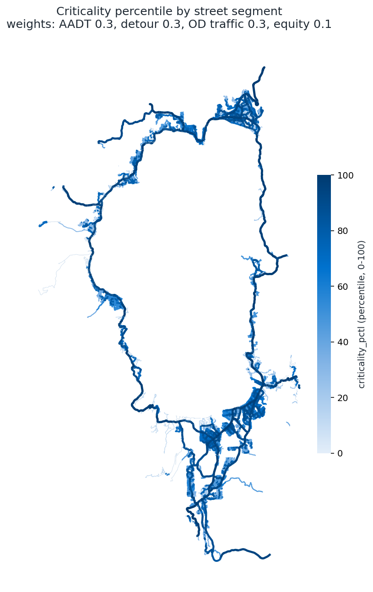
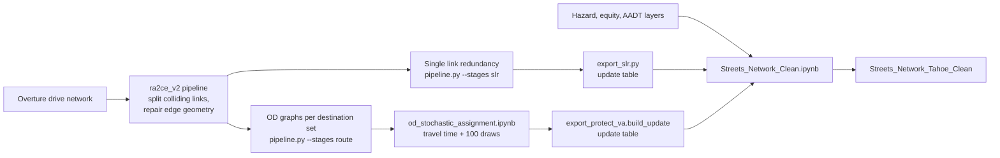
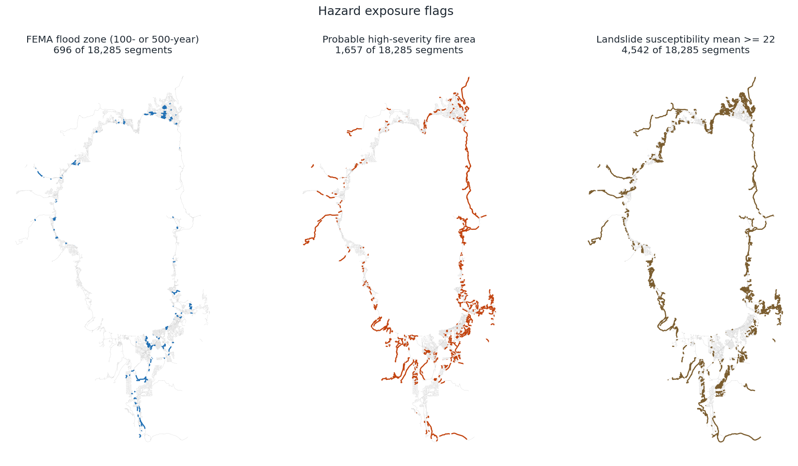
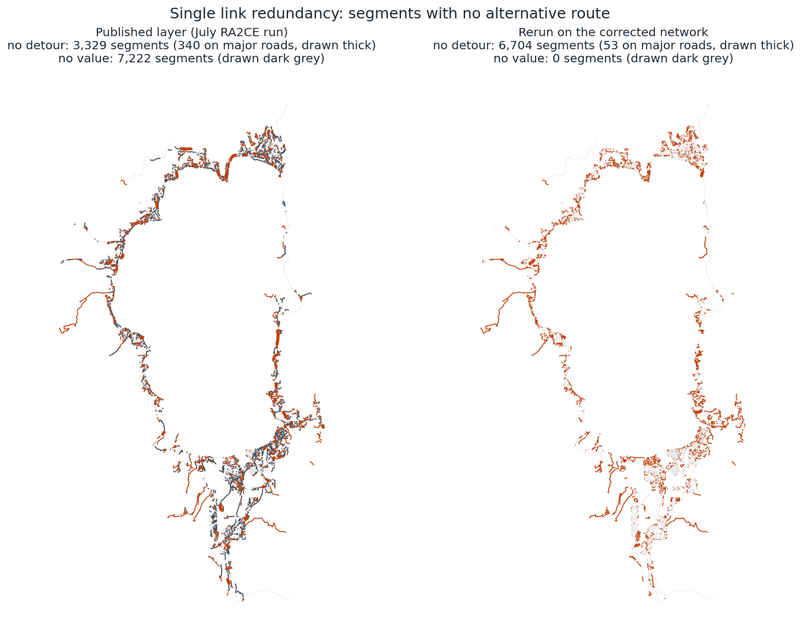
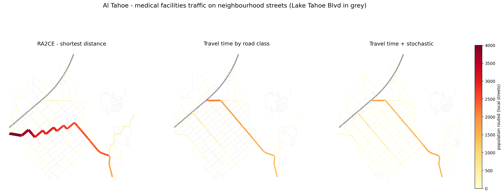
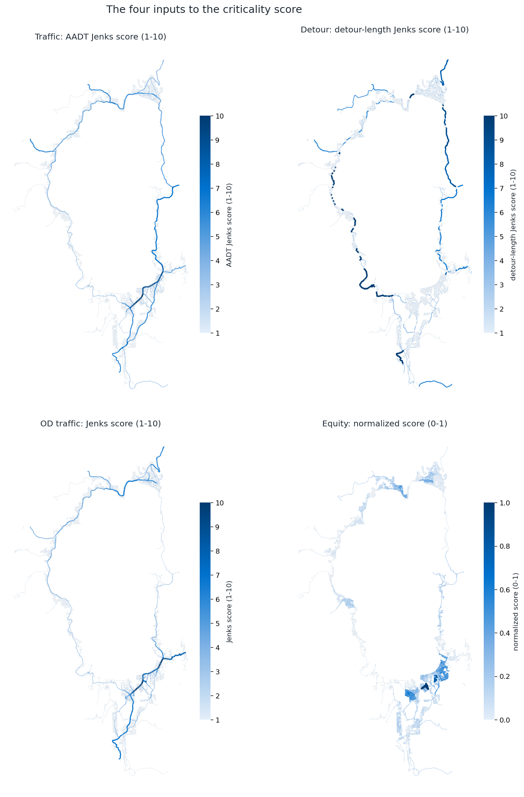

# Methods: Streets Network Clean (`Streets_Network_Tahoe_Clean`)

**Task:** PROTECT 3.2 / 3.3 - fully attributed street network for the vulnerability assessment and the Risk Index Tool
**Pipeline:** `scripts/Streets_Network_Clean.ipynb`, fed by `scripts/ra2ce_v2/` (detour length) and `scripts/ra2ce_v2/od_stochastic_assignment.ipynb` (origin-destination traffic)
**Last reviewed:** 2026-10-08

## Purpose

Build one street layer that carries every attribute the PROTECT risk index uses: hazard exposure,
equity, traffic volume, detour length, origin-destination (OD) traffic to critical services, and a
composite criticality score. Before this pipeline, those fields were written into
`Streets_Network_Tahoe` in place by three separate notebooks (`Hazard_Vulnerability.ipynb`,
`Asset_Criticality.ipynb`, `Asset_Scoring.ipynb`), with no record of run order and several known
defects. The clean build recomputes every field from source in one pass and writes a new feature class.
`Streets_Network_Tahoe` is read and never modified.

## Outputs

| Output | Location |
|---|---|
| Feature class `Streets_Network_Tahoe_Clean` (18,285 segments, 69 fields) | `F:\GIS\PROJECTS\Transportation\Protect\PROTECT_analysis\PROTECT_analysis.gdb` |
| GeoPackage copy | `scripts/outputs/streets_network_clean/streets_network_tahoe_clean.gpkg` |
| Field dictionary (type, alias, group, source, method, null count for every field) | `scripts/outputs/streets_network_clean/streets_network_tahoe_clean_fields.csv` |
| Before/after comparison with the published layer | `scripts/outputs/streets_network_clean/streets_network_tahoe_clean_qa.csv` |

The `scripts/outputs/` folder is gitignored. OBJECTIDs in the new feature class equal the source
OBJECTIDs, which are also kept in `src_objectid`. That field is the join key to `Streets_Network_Tahoe`
and to the published PROTECT_VA service. `segment_id` repeats across segments (one Overture segment is
split at every connector) and cannot be used as a key.

*Figure 1. `criticality_pctl` for all 18,285 segments. Darker and thicker lines score higher.*

## Pipeline overview

Run order for a full rebuild:

1. `scripts/ra2ce_v2/pipeline.py --stages prepare basegraph repair` (about 4 minutes). Builds the corrected routing graph.
2. `scripts/ra2ce_v2/pipeline.py --stages route` (about 4.5 hours). Builds the OD graph for each destination set. The routing results from this stage are kept as the RA2CE baseline; the OD traffic in the clean layer is re-routed in step 5.
3. `scripts/ra2ce_v2/pipeline.py --stages slr` (about 2.5 minutes), then `scripts/ra2ce_v2/export_slr.py`.
4. `scripts/ra2ce_v2/export_combined.py` and `export_protect_va.py` (only needed for the RA2CE baseline table).
5. `scripts/ra2ce_v2/od_stochastic_assignment.ipynb` (about 4 minutes).
6. `scripts/Streets_Network_Clean.ipynb` (about 3 minutes of analysis plus 2 to 10 minutes to write to F:). Set `OVERWRITE = True` to replace an existing output.

Steps 1, 2 and 4 only need rerunning when the network or the origins and destinations change.
Use the `arcgispro-py3-plotly` conda environment for every step. Close ArcGIS Pro layers that point at
RA2CE outputs before step 2, since RA2CE deletes and rewrites its GeoPackages.

## Data sources

| Input | What it is | Where it lives | Original source | Used for |
|---|---|---|---|---|
| Street network | 18,285 in-basin drivable segments with class, name, length and drive time | `PROTECT_analysis.gdb\Streets_Network_Tahoe` | Overture Maps transportation data, built into a routable network by the TRPA data team (`Overture_Drive_Routable` in `Streets_Network.gdb`) | Geometry and identity fields for every output row |
| Routing network | The same Overture network including roads outside the basin, 95,285 features | `scripts/ra2ce/static/network/overture_drive_routable.shp`, split to 97,814 features in `scripts/ra2ce_v2/static/network/overture_split.shp` | As above | Detour length and OD routing |
| Flood zones | 404 FEMA flood hazard polygons, zones A and AE (100-year) and X (500-year) | `PROTECT_analysis.gdb\FEMA_Flood_Zone` | FEMA National Flood Hazard Layer | `in_flood_zone`, `in_flood_zone_100` |
| Fire severity | Forest management zones intersected with probable fire severity; `gridcode = 1` marks "Higher" probability of high-severity fire | `PROTECT_analysis.gdb\ForestManagementZone_Identity_HighSeverityProbability` | TRPA forest management zones and functional fire severity layer (upstream source to confirm) | `high_sev_fire` |
| Landslide | National landslide susceptibility raster, NAD83 geographic, about 70 m by 150 m cells, values 0 to 81 | `PROTECT_analysis\usgs_landslide_risk.tif` | USGS (exact product and version to confirm) | `landslide_mean`, `landslide_max` |
| Block-group demographics | 77 block groups with household and population counts | `PROTECT_analysis.gdb\Block_Group_Layer` | American Community Survey fields from TRPA's curated census tables (vintage to confirm) | The four equity inputs |
| Traffic volume | 1,319 modeled road segments with `Estimated_2024_AADT` | `PROTECT_analysis.gdb\AADT_Streetlight_Attributed` | Licensed modeled AADT product held by TRPA | `Estimated_2024_AADT` and its Jenks score |
| OD origins | 2,201 hexagon centroids; population = `total_population` (53,972 residents) | `scripts/ra2ce_v2/static/network/Origins.shp` | TRPA SDE `SDE.Census\SDE.Tahoe_Census_Curated`, hex-grid records for `year_sample = 2024` | Trip origins and trip counts |
| Equity weights | Block-group weight = 1 + normalized poverty rate (range 1 to 2) | `scripts/ra2ce_v2/static/network/blockgroup.shp`, `blockgroup_weights.csv` | Same SDE table, block-group records for 2024 | `prioritarian_*` OD fields |
| Basin exits | 7 highway exit points (SR 207, SR 89 twice, US 50 twice, SR 431, SR 267) | `scripts/ra2ce_v2/static/network/Destinations.shp` | TRPA (`AutoEntryPoint` in `Streets_Network.gdb`) | Evacuation destinations |
| Law enforcement | 7 stations and substations | `PROTECT_analysis.gdb\LocalLawEnforcement` | TRPA | Law-enforcement destinations |
| Medical facilities | 5 hospitals, health centers and urgent care clinics | `PROTECT_analysis.gdb\MedicalFacilities` | TRPA | Medical destinations |
| Emergency shelters | 9 community centers, recreation centers and schools | `PROTECT_analysis.gdb\EvacuationShelters` | TRPA | Shelter destinations |

## Method

### 1. Base network

Only the identity fields are read from `Streets_Network_Tahoe`: `segment_id`, `from_connector`,
`to_connector`, `class`, `name`, `length_m`, `DriveTime` and `In_Basin`. Every analytic field is rebuilt.
Geometry is forced to 2D. The layer is in NAD83 / UTM zone 10N (EPSG:26910).

### 2. Hazard exposure

*Figure 2. Segments flagged by each hazard layer. The landslide panel uses the Criticality Index app's default threshold of 22.*

| Field | Rule | Segments |
|---|---|---|
| `in_flood_zone` | Intersects any FEMA flood zone (100- or 500-year) | 696 |
| `in_flood_zone_100` | Intersects a zone with `FLOOD_YEAR = '100-year flood'` | 396 |
| `high_sev_fire` | Intersects a polygon with `gridcode = 1` | 1,657 |
| `landslide_mean`, `landslide_max` | Mean and maximum susceptibility over the raster cells the segment crosses | all |

Flags are 1 when the segment intersects at least one qualifying polygon. The landslide statistics are
computed by sampling each segment every quarter cell in the raster's own coordinate system and keeping
one sample per raster cell, so each cell a segment crosses counts once. Every segment's midpoint is
always sampled, so short segments that fall between cell centers still get a value. The published layer
used `ZonalStatisticsAsTable`; both methods give the same value on most segments, and the differences
fall mainly on segments shorter than 100 m.

### 3. Equity

For each of four block-group counts (`Below_Poverty_Household`, `Speak_English_Not_Well_Not_at_A`,
`Vehicle_Available_0`, `With_Disability`), a segment takes the maximum over every block group it
intersects (`*_max`). The 32 segments that touch no block group polygon take the nearest block group,
recorded as `equity_bg_match = 'nearest'`.

* `*_max_Normalized`: min-max scaling of each count to 0-1.
* `Equity_Score`: the sum of 0.25 times the z-score of each count.
* `Equity_Score_Normalized`: min-max scaling of `Equity_Score` to 0-1.

### 4. Traffic volume (AADT)

Each segment is matched to the modeled AADT line whose 5 m buffer covers the largest share of the
segment, provided that share is at least 50% of the segment's length. Where two AADT lines cover the
segment equally (both directions of a divided road), the larger AADT is used. 7,748 segments match.

`Estimated_2024_AADT_Filled` uses, in order:

1. the matched AADT (`aadt_source = 'streetlight'`);
2. for trunk, primary, secondary and tertiary segments with no match, the highest AADT among touching
   segments, repeated along chains of unmatched segments (`'neighbor'`; 168 segments);
3. 0 for everything else (`'none'`), mostly local and service streets with no modeled volume.

`AADT_Jenks_Score` places the filled AADT into 10 Jenks natural-break classes (1 to 10).

### 5. Detour length (single link redundancy)

Single link redundancy removes one link at a time from the routing graph and measures the shortest
alternative route between the link's two ends. It reports the extra distance of that detour
(`diff_length`) and whether any detour exists (`detour`).

The published values came from a July RA2CE run on a routing graph with two defects, documented in
`scripts/ra2ce_v2/README.md`:

* **Collapsed parallel links.** RA2CE builds a simple graph, so two links sharing both end points merge
  and one of them disappears. 2,529 links were lost this way. On divided roads this produced false
  "no detour" results.
* **Straight-line edge geometry.** Merged chains of links were drawn and measured as straight lines
  between nodes, understating the length of curved roads.

The `ra2ce_v2` pipeline splits each colliding link at its midpoint and rebuilds merged edges from their
true geometry before any analysis. `pipeline.py --stages slr` then runs RA2CE's single link redundancy
on that corrected graph (80,785 links, distance-weighted). `export_slr.py`:

1. carries each link's result to the Overture segments it covers through RA2CE's own segment mapping
   (`rfid_c`), so values sit on true geometry;
2. sets the 2,190 self-loops to detour = 1 and extra distance 0, since RA2CE reports a loop's
   "alternative" from a node to itself as 0 m, which gives a negative extra distance;
3. sets the remaining 3,633 negative extra distances to 0. 2,139 are the longer of two parallel links,
   where the alternative is the shorter parallel link; 1,489 are winding links whose end points are also
   joined by a shorter route. Removing either kind adds no distance;
4. joins the segments to the 18,285 streets. A segment contributes to a street when at least half of
   the segment runs within 5 m of the street's interior (the street minus 5 m at each end), so a short
   link meeting the street end-on does not count. Per street, `slr_diff_length_raw` is the largest extra
   distance among contributing segments and `slr_detour_max` the smallest detour flag.

*Figure 3. Segments with no alternative route, published layer against the rerun. Thick lines are major roads.*

Every street now has a value. In the published layer, 6,117 streets had no detour length and 7,222 had
no detour flag. False "no detour" results on major roads fell from 340 to 53. The total count of "no detour" streets rose because the streets that previously had no value
are now included; most of them are dead-end service and residential streets.

`slr_diff_length_max` (the name the Criticality Index app reads):

1. the extra distance where a detour exists (`slr_source = 'detour'`);
2. 0 where no detour exists (`'no_detour'`);
3. for the 53 trunk, primary, secondary and tertiary streets with no detour, the highest value among
   touching streets (`'neighbor'`).

`SLR_Diff_Length_Jenks_Score` places `slr_diff_length_max` into 10 Jenks classes.

### 6. OD traffic to critical services

OD traffic counts how many residents travel over each street when every origin travels to a set of
destinations. Four destination sets are routed:

| Analysis | Destinations | How each origin's trips are split |
|---|---|---|
| Evacuation | 7 basin highway exits | All trips to the nearest exit |
| Law enforcement | 7 stations | All trips to the nearest station |
| Medical facilities | 5 facilities | Gravity: shares proportional to 1 / travel cost², across all facilities |
| Emergency shelters | 9 shelters | Gravity, as for medical |

Medical and shelter trips use gravity splitting because several facilities sit close together (Barton
Memorial Hospital and Tahoe Urgent Care are 600 m apart), so assigning every trip to the single nearest
one would leave the other facility's access roads empty.

**Routing.** RA2CE's own router uses shortest distance and has no road hierarchy: every edge in its
routing graph carries the same default speed, because the road class field was never passed to it.
In street grids, dozens of staircase paths have almost the same length, and the router sends every
trip from a neighborhood along one of them. `od_stochastic_assignment.ipynb` re-routes the four
analyses on the same RA2CE graphs with two changes:

1. **Travel time by road class.** Each segment gets a free-flow speed from its Overture class, and each
   edge's time is the sum over the segments it covers. These speeds are starting assumptions and should be
   calibrated:

   | Class | mph | Class | mph |
   |---|---|---|---|
   | motorway | 55 | unclassified | 25 |
   | trunk | 45 | residential | 25 |
   | primary | 35 | service | 10 |
   | secondary | 30 | living_street | 10 |
   | tertiary | 30 | unknown | 15 |

2. **Stochastic assignment.** The routing runs 100 times. In each run every edge's travel time is
   multiplied by an independent random factor (lognormal, mean 1, about 25% variation), and the traffic is
   averaged over the runs. Routes that are nearly tied share the trips, and a clearly faster route still
   carries most of them. The destination choice is also remade in each run.

Origins, populations, equity weights and destination rules are unchanged from the RA2CE run. Each
analysis yields `traffic` (residents routed), `egalitarian` (origins routed, unweighted), `prioritarian`
(residents times the equity weight), `routed` and `par_alt` (a segment that lies only on a parallel link
that never carries trips). Results are joined to streets with the same two-sided rule as the detour
lengths (`export_protect_va.build_update`).

**Checks.**

* With distance cost and no random variation, the new router reproduces RA2CE's person-kilometres
  exactly in all four analyses, and segment traffic correlates with RA2CE's at 0.9996 or higher.
* In all 404 routing runs (101 per analysis), the trips arriving at each destination equal the trips sent
  there, and the trips sent equal the 53,933 residents whose origins can reach a destination.
* Splitting the 100 runs into two halves of 50 gives segment results that correlate at 0.999 and differ
  by a median of 2 to 3%.

Summed street traffic counts segment crossings: a trip adds its residents to every segment it crosses,
so the sum grows with the number of segments on the routes. Compare methods on individual streets or on
person-kilometres.

*Figure 4. Medical-facility trips on Al Tahoe neighborhood streets. RA2CE's shortest-distance routing sends
the neighborhood's trips along one staircase of residential blocks (2,500 to 4,000 residents per block on
William and Osborne Avenues). Travel time moves them to the collectors (O'Malley Drive, Martin Avenue,
Sierra Boulevard), and stochastic assignment spreads the remainder across the grid.*

| Street | Class | RA2CE (distance) | Travel time | Travel time + stochastic |
|---|---|---|---|---|
| William Avenue | residential | 3,665 | 0 | 100 |
| Osborne Avenue | residential | 2,559 | 111 | 82 |
| Sierra Boulevard | tertiary | 2,941 | 692 | 925 |
| Martin Avenue | tertiary | 2,559 | 1,710 | 1,615 |
| O'Malley Drive | tertiary | 447 | 2,148 | 1,816 |
| Barbara Avenue | tertiary | 65 | 67 | 245 |
| Lodi Avenue | residential | 347 | 348 | 438 |

Basin-wide, the residential share of person-kilometres falls by about a third in every analysis, and
trunk and primary roads take it up. `OD_METHOD = "ra2ce"` in `Streets_Network_Clean.ipynb` switches the
clean layer back to the RA2CE shortest-distance results.

### 7. Criticality score

*Figure 5. The four inputs to the criticality score.*

Each input is converted to a z-score using the population standard deviation (a missing value scores 0),
and the four sub-indices are combined with fixed weights (`CRIT_WEIGHTS`):

| Sub-index | Input | Weight |
|---|---|---|
| `traffic_subindex` | `AADT_Jenks_Score` | 0.3 |
| `detour_subindex` | `SLR_Diff_Length_Jenks_Score` | 0.3 |
| `od_subindex` | `OD_Traffic_Jenks_Score` | 0.3 |
| `equity_subindex` | 0.25 times the z-score of each of the four `*_max` equity counts | 0.1 |

`OD_Traffic_Avg` is the mean of the four `traffic_*` OD fields. It is placed into 10 Jenks classes
(`OD_Traffic_Jenks_Score`) like AADT and detour length, which keeps a few very heavy corridors from
pushing every other street toward zero. The equity-weighted `prioritarian_*` fields are left out of this
average because equity has its own sub-index.

`criticality_score` is the weighted sum and `criticality_pctl` its percentile rank (0 to 100). The
highest-scoring streets are US 50 (Trooper Gary Gifford Highway and Route 50), Lake Tahoe Boulevard,
Tahoe Boulevard and Kingsbury Grade, which rank high on all three traffic-type inputs. Adding OD traffic
moved the top 10% of streets toward primary roads (38% to 47%) and away from residential streets (10% to
1%).

### 8. Assembly and quality checks

A single schema table sets every field's name, type, text length, alias, group, source and method. It
writes the field dictionary CSV and builds the feature class. The notebook stops if any of these checks
fails:

* row count equals the base layer, and `src_objectid` is unique;
* no missing OD fields, equity inputs, hazard flags, filled AADT, detour lengths or criticality scores;
* no negative detour lengths;
* every Jenks score lies between 1 and 10;
* the OD tables' OBJECTIDs match the base layer, and `segment_id` and `length_m` agree on every
  OBJECTID with the published PROTECT_VA layer.

The output is built in a local file geodatabase next to the GeoPackage and copied to F: in one
operation; individual schema operations on the F: drive take about 30 seconds each.

## Fixes relative to the published layer

| Issue in `Streets_Network_Tahoe` | Fix |
|---|---|
| 388 streets had no OD values (RA2CE parallel-link collapse) | OD traffic from the corrected network; 0 missing |
| OD traffic stacked on single residential routes in street grids | Travel-time routing with stochastic assignment |
| Detour lengths from the defective July graph; 6,117 streets with none | Rerun on the corrected network; every street has a value |
| Detour neighbor fill split across two fields; the Jenks score saw only one fill | One fill into `slr_diff_length_max`, before scoring |
| 555 negative detour lengths | Self-loops neutralized, remaining negatives set to 0 |
| 48 trunk segments with no AADT; unmatched primary segments scored as zero traffic | Major-road gaps filled from touching segments |
| 32 streets with no equity values | Nearest block group |
| `in_flood_zone_100` computed but never added | Added |
| `diff_length_max` and `detour_max` held one constant value (broken code) | Dropped, along with empty editor-tracking, `surface` and `speed_limit_kmh` fields |
| Criticality score had no OD component | OD traffic added at weight 0.3 |

## Limitations and open items

* **Provenance to confirm:** the upstream source of the fire-severity layer, the USGS product and
  version of the landslide raster, and the ACS vintage of the block-group demographics.
* **Speeds by road class** are assumptions. They have the largest effect on the OD results and should be
  calibrated.
* **One-way streets and turn restrictions** are ignored. RA2CE builds an undirected network, and the OD
  router uses the same graph.
* **No congestion.** OD traffic measures how many residents depend on a street, without capacity or delay.
* **Streets with no detour score 0** on the detour input. Strictly, losing a link with no alternative is
  the most disruptive case, but these are mostly driveways and cul-de-sacs serving few trips.
* **Criticality Index app.** The app's default score uses three sub-indices at equal weight and no OD
  term, so it does not match `criticality_score` until the app is updated.
* **Multi-segment streets.** Where a street joins several criticality segments that disagree, OD values
  are length-weighted means. Check `od_row_spread_pct` before quoting one figure for such a street.
